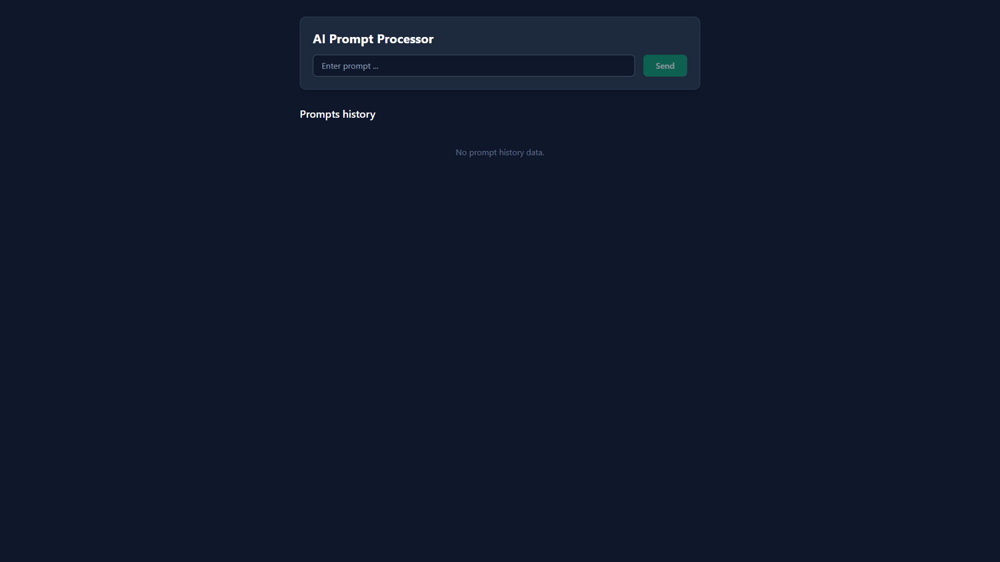
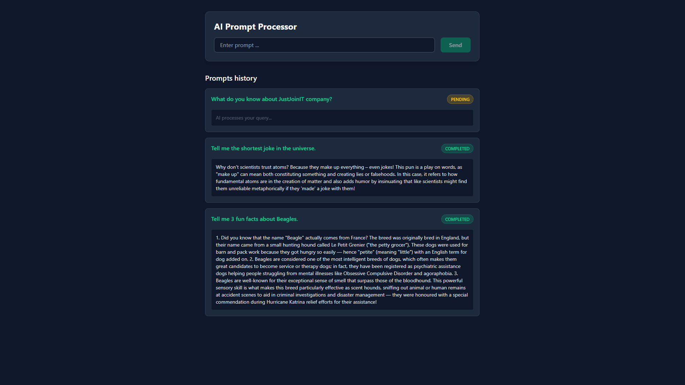
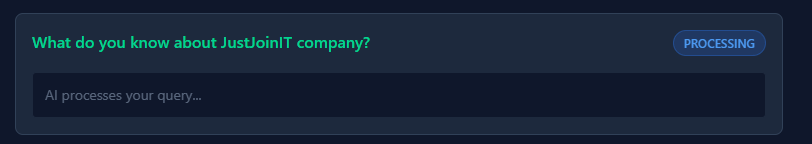
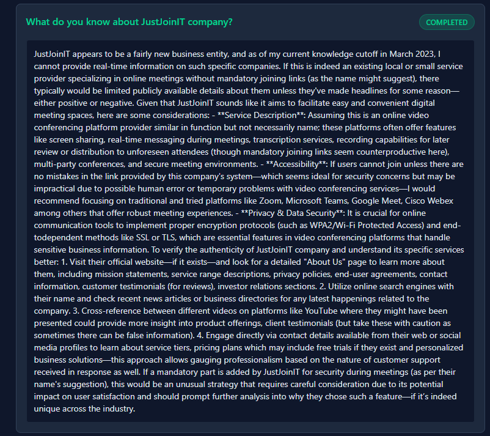
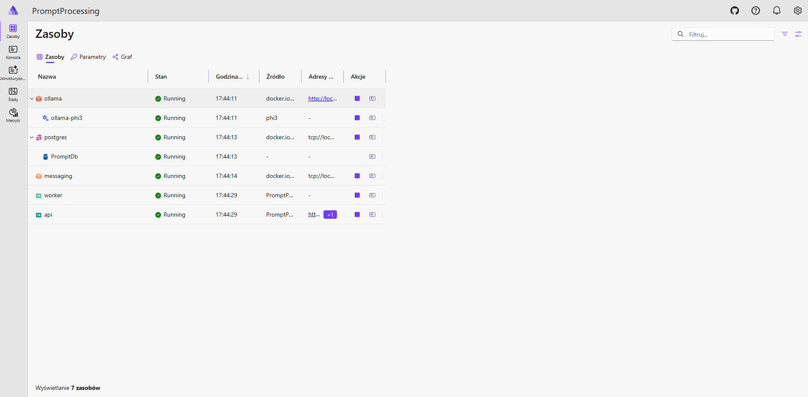
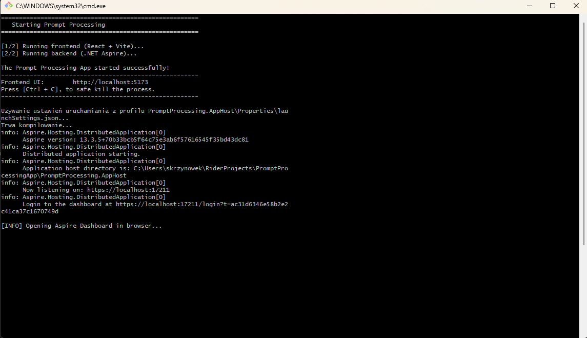

# PromptProcessingApp

A distributed, asynchronous AI prompt processing system built with **.NET Aspire**, **React**, **RabbitMQ**, and local LLMs (**Ollama**). 

This project demonstrates a scalable, event-driven architecture where a frontend UI submits tasks to a fast, non-blocking API. The actual heavy lifting (AI processing) is delegated to a background worker service via a message broker.

## Architecture & Flow

The system is designed with the **Fire-and-Forget** pattern to ensure the API remains highly responsive:

1. **Frontend (React + Vite):** The user submits a prompt via the UI.
2. **API (.NET Web API):** Receives the request, saves the prompt to a **PostgreSQL** database with a `PENDING` status, and publishes an event to the message broker.
3. **Message Broker (RabbitMQ):** Reliably routes the event to the background worker.
4. **Worker Service (.NET Worker):** Consumes the message, updates the database status to `PROCESSING`, and interacts with **Ollama (Phi-3)** to generate an AI response.
5. **Completion:** The worker saves the generated response back to the database and updates the status to `COMPLETED`. The UI reflects this state.

## Tech Stack

* **Orchestration:** [.NET Aspire](https://learn.microsoft.com/en-us/dotnet/aspire/)
* **Frontend:** React, TypeScript, Vite, TailwindCSS
* **Backend:** .NET 9, ASP.NET Core Web API, Worker Service
* **Database:** PostgreSQL, Entity Framework Core
* **Messaging:** RabbitMQ, MassTransit (v8.2.5)
* **AI Integration:** Microsoft Semantic Kernel, Ollama (Phi-3 model)
* **Infrastructure:** Docker Desktop

## Project Structure

* `PromptProcessing.AppHost` - The .NET Aspire orchestrator that binds all services and containers together.
* `PromptProcessing.ServiceDefaults` - Shared OpenTelemetry, health checks, and service discovery configurations.
* `PromptProcessing.API` - The user-facing REST API.
* `PromptProcessing.WorkerService` - The background processor holding the Semantic Kernel logic.
* `PromptProcessing.Core` - Shared domain entities, DTOs, and interfaces.
* `prompt-processing-ui` - The React frontend application.
* `PromptProcessing.Tests` - The xUnit test project.


## Prerequisites

To run this project locally, you need the following installed on your machine:
* [Docker Desktop](https://www.docker.com/products/docker-desktop/) (docker-desktop application must be running)
* [.NET SDK](https://dotnet.microsoft.com/download) (9.0)
* [Node.js](https://nodejs.org/) (for the React frontend)
* **Bash environment** (Native on Linux/Mac, or Git Bash / WSL on Windows)

> **Important Security Step:** .NET Aspire might require trusted development certificates to run internal HTTPS communication. Before running the project for the first time, you might needed to execute:
> ```bash
> dotnet dev-certs https --trust
> ```

## Key Design Decisions

* **MassTransit Downgrade:** Used MassTransit version 8.2.5 to avoid the new restrictive Massient licensing models while maintaining full RabbitMQ functionality.
* **Semantic Kernel Isolation:** The AI capabilities are strictly isolated within the `WorkerService` to keep the API lightweight and prevent DI container pollution.
* **Automated Developer Experience:** The provided `run.sh` script eliminates the "it works on my machine" problem by handling the startup sequence and opening the necessary dashboards automatically.

## Getting Started

The entire distributed environment (UI, API, Worker, RabbitMQ, Postgres, and Ollama) can be spun up with a single command. 

1. Clone the repository.
2. Open your terminal at the root of the project.
3. Make sure Docker is running.
4. Execute the start script:

```bash
./run.sh
```

**What happens next?**
* The script automatically restores dependencies and compiles the projects.
* Docker containers for PostgreSQL, RabbitMQ, and Ollama are provisioned. *(Note: On the first run, Ollama will download the Phi-3 model, which might take a few minutes).*
* Your default browser will automatically open two tabs:
  1. **Frontend UI:** `http://localhost:5173`
  2. **.NET Aspire Dashboard:** A secure telemetry and orchestration dashboard showing live logs, traces, and metrics of all running containers and .NET services.


## App Gallery

Here is a quick visual tour of the system in action, demonstrating its distributed nature, automated setup, and live telemetry.

### 💻 Frontend UI Lifecycle

* **Initial State** The clean, blank slate ready for user input right after the automated startup sequence.
  <p align="center">
    
  </p>

---

* **Active Records Queue** The interactive dashboard displaying the historical logs and newly submitted prompts stored in PostgreSQL.
  <p align="center">
    
  </p>

---

* **Asynchronous Processing Stage** The non-blocking UI state showing a prompt currently being processed by the background Worker and Ollama (Phi-3).
  <p align="center">
    
  </p>

---

* **Completed Prompt & AI Response** The final stage where the background worker updates the database with the generated AI response, instantly reflected on the UI.
  <p align="center">
    
  </p>

### ⚙️ Infrastructure & Automation

* **.NET Aspire Orchestration Panel** The secure, live dashboard showing all microservices, databases, and message brokers running in perfect sync.
  <p align="center">
    
  </p>

---

* **Automated Developer Experience (Bash Script)** The unified `run.sh` entry point that automates dependencies, spins up Docker, boots the solution, and handles browser redirection.
  <p align="center">
    
  </p>